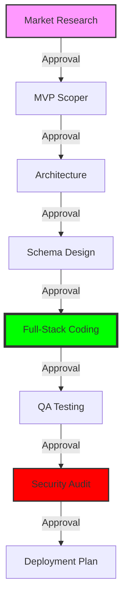

# Agent Startup Skills

> **An 8-phase AI agent pipeline for building SaaS products with mandatory approval gates. Supports Antigravity, Claude Code, and Codex.**

<br />

[](https://github.com/Aizaz-Noor/Agent-Startup-Skills/stargazers)
[](LICENSE)
[](https://github.com/google/antigravity)
[](https://github.com/anthropics/claude-code)
[](https://github.com/codex-agent)
[](https://github.com/Aizaz-Noor/Agent-Startup-Skills/releases/latest)

<br />

**Agent Startup Skills** is a high-performance framework designed to turn raw SaaS ideas into production-ready codebases. Instead of a single prompt, it uses a modular "Digital Team" that works through a strictly governed 8-phase pipeline.

**Explore the Ecosystem:** [📚 Browse the Full Catalog](CATALOG.md) · [📖 Usage Guide](docs/users/usage.md) · [🤖 Claude Code Guide](docs/users/claude-code-skills.md) · [🔄 Workflows (JSON)](data/workflows.json)

---

## 📑 Table of Contents
- [Why This Repo](#why-this-repo)
- [Installation](#installation)
- [The Engineering Pipeline](#the-engineering-pipeline)
- [Meet Your Digital Team](#meet-your-digital-team)
- [Quick FAQ](#quick-faq)
- [Contributing](#contributing)
- [Security & License](#security--license)

---

## 🛠️ Why This Repo
- **Human-in-the-Loop**: 8 mandatory approval gates ensure you stay in control of your code.
- **Role-Based Specialization**: Skills are split into distinct personas (Architect, Coder, Auditor) for higher quality output.
- **Universal Install**: One `npx` command sets up your entire agent workspace in seconds.
- **Security Hardened**: Built-in security auditor phase (Phase 7) for OWASP compliance check.
- **Machine Readable**: formally defined workflows in `data/workflows.json` for agent-to-agent coordination.

---

## 🚀 Installation

### 1. Automatic Install (Recommended)
Install the complete framework across any system with our feature-rich CLI installer:
```bash
npx -y github:Aizaz-Noor/Agent-Startup-Skills
```

### 2. Precise Targeting (CLI Flags)
| Goal | Command |
| :--- | :--- |
| **Install Everything** | `npx -y github:Aizaz-Noor/Agent-Startup-Skills` |
| **Only Claude Code** | `npx -y github:Aizaz-Noor/Agent-Startup-Skills --claude` |
| **Only Codex** | `npx -y github:Aizaz-Noor/Agent-Startup-Skills --codex` |
| **Project-Local Only** | `npx -y github:Aizaz-Noor/Agent-Startup-Skills --project` |
| **Custom Path** | `npx -y github:Aizaz-Noor/Agent-Startup-Skills --path ./my-skills` |

---

## 🏗️ The Engineering Pipeline
The system uses a sequential "Waterfall-Agile" hybrid flow with mandatory approval gates.



---

## 👥 Meet Your Digital Team

### 🔍 Research & Strategy
- **`@[market-scout]`**: Identifies competitive landscapes and core risks.
- **`@[mvp-scoper]`**: Ruthlessly prioritizes features for a lean v1.

### 📐 Engineering & Design
- **`@[system-architect]`**: Defines tech stack, file structure, and API contracts.
- **`@[schema-designer]`**: Models complex data relationships and schemas.
- **`@[fullstack-coder]`**: Implements the complete codebase from architecture specs.

### 🛡️ Quality & Hardening
- **`@[test-engineer]`**: Writes unit/integration tests and QA reports.
- **`@[security-auditor]`**: Audits for OWASP vulnerabilities and logic flaws.

### 🚀 Infrastructure
- **`@[deploy-planner]`**: Prepares Dockerfiles and launch guides.

---

## ❓ Quick FAQ

**What is the Startup Factory?**  
It's the master orchestrator (`saas-accelerator`) that coordinates all 8 specialists in order.

**Can I use specific agents standalone?**  
Yes! Just use the trigger phrases (e.g., *"Audit security of this repo"* or *"Design a schema for a library app"*).

**Does this work on Windows?**  
Yes. The `npx` installer and the manual `mkdir -p` paths are fully Windows-compatible.

---

## 🤝 Contributing
We welcome contributions! See [CONTRIBUTING.md](./CONTRIBUTING.md) for the mandatory YAML template.

## 📄 License & Credits
Licensed under the [MIT License](LICENSE). 

Special thanks to the engineering patterns inspired by:
- **Anthropic Skills**
- **Vercel Agent Skills**
- **Antigravity Awesome Skills**
